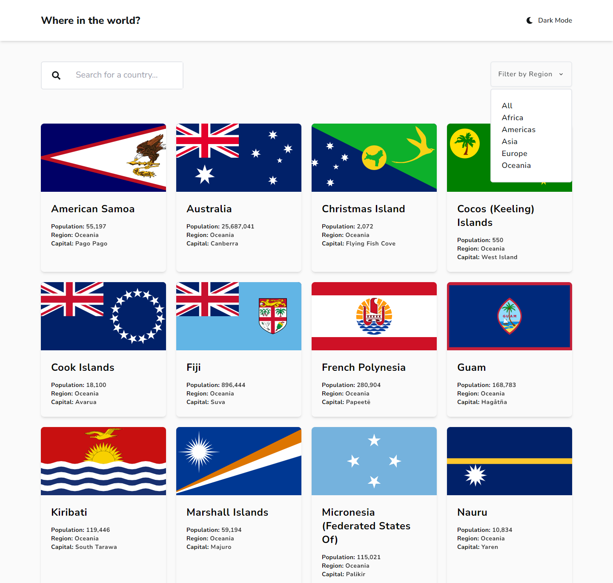

# Frontend Mentor - REST Countries API with color theme switcher solution

This is a solution to the [REST Countries API with color theme switcher challenge on Frontend Mentor](https://www.frontendmentor.io/challenges/rest-countries-api-with-color-theme-switcher-5cacc469fec04111f7b848ca). Frontend Mentor challenges help you improve your coding skills by building realistic projects.

## Table of contents

- [Overview](#overview)
  - [The challenge](#the-challenge)
  - [Screenshot](#screenshot)
  - [Links](#links)
- [My process](#my-process)
  - [Built with](#built-with)
  - [Continued development](#continued-development)
- [Author](#author)
- [Acknowledgments](#acknowledgments)

## Overview

### The challenge

Users should be able to:

- See all countries from the API on the homepage
- Search for a country using an `input` field
- Filter countries by region
- Click on a country to see more detailed information on a separate page
- Click through to the border countries on the detail page
- Toggle the color scheme between light and dark mode _(optional)_

### Screenshot

### Links

- Solution URL: [https://www.frontendmentor.io/solutions/responsive-rest-country-api-with-theme-toggler-using-react-tailwind-2O_D0D4aSl](https://www.frontendmentor.io/solutions/responsive-rest-country-api-with-theme-toggler-using-react-tailwind-2O_D0D4aSl)
- Live Site URL: [https://country-frontendmentor.netlify.app/](https://country-frontendmentor.netlify.app/)

## My process

### Built with

- Flexbox
- Mobile-first workflow
- [React](https://reactjs.org/) - JS library
- [React Router Dom](https://reactrouter.com/en/main) - Routing
- [Tailwind Css](https://tailwindcss.com/) - For styles
- [Framer Motion](https://www.framer.com/motion/) - For styles

### Continued development

Continue development in making layouts and functionality. Using Mobile First workflow

## Author

- Website - [Sudip Khatri](https://sudipkhatri.netlify.app/)
- Frontend Mentor - [@SudipKhatri036](https://www.frontendmentor.io/profile/SudipKhatri036)
- Twitter - [Sudip Khatri](https://www.linkedin.com/in/sudip-khatri-a72a6a27b/)
